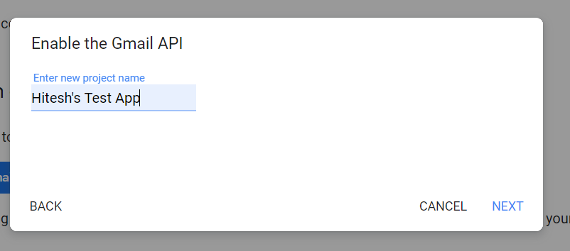

# OAuth-API-
The OAuth API is an authorization framework for delegated access to APIs. It involves clients that request scopes that Resource Owners authorize/give consent to. Authorization grants are exchanged for access tokens and refresh tokens (depending on flow). 

The code has been written in Node.js

To use this API, follow the following commands – 
1.	Go to the link https://developers.google.com/gmail/api/quickstart/nodejs , go to Step 1 and click on the “Enable the Gmail API” button. 

2.	Give a name to your new project and click on “Next” . 
 

3.	Configure your OAuth client by selecting from the several options from the drop down menu. In my case, I have selected Web server and entered http://localhost as my path because I don’t have a frontend application ready as for the testing case. After entering the path, click on “Create” button. Then, download the client configuration and save the credentials.json for further use. 

4.	Create a simple Node.js command-line application and run the following command to install the libraries using npm: 
npm install googleapis@39 –save

5.	Copy the index.js from the repository and save it in the current working folder. You also need to paste the credentials.json which you downloaded earlier into the current working folder.

<b>NOTE </b>: In the credentials.json file, replace the “web” key with “installed” key and save the changes. 

 

6.	Run the code by typing “node .” in the terminal. 

7.	Browse to the provided URL in your web browser. The link would appear in the terminal like- 
  
If you are not already logged into your Google account, you will be prompted to log in. If you are logged into multiple Google accounts, you will be asked to select one account to use for the authorization.
The OAuth consent screen that is presented to the user may show the warning "This app isn't verified" if it is requesting scopes that provide access to sensitive user data. These applications must eventually go through the verification process to remove that warning and other limitations. During the development phase you can continue past this warning by clicking Advanced > Go to {Project Name} (unsafe).

8.	Select the Email with which you want to login

9.	Allow the QuickStart to access the information by clicking on “Allow”.

10.	Copy the URL from the search bar in the browser. Select the part of the URL starting after  ‘code=’ and ending before ‘&score’ .

11.	Paste the selected part of the URL in the terminal and hit enter. 

12.	Hurray! You have got the token.json file which has the access token, refresh token, scope and token type of the user. You can also use the Labels of the emails of the user.

 

